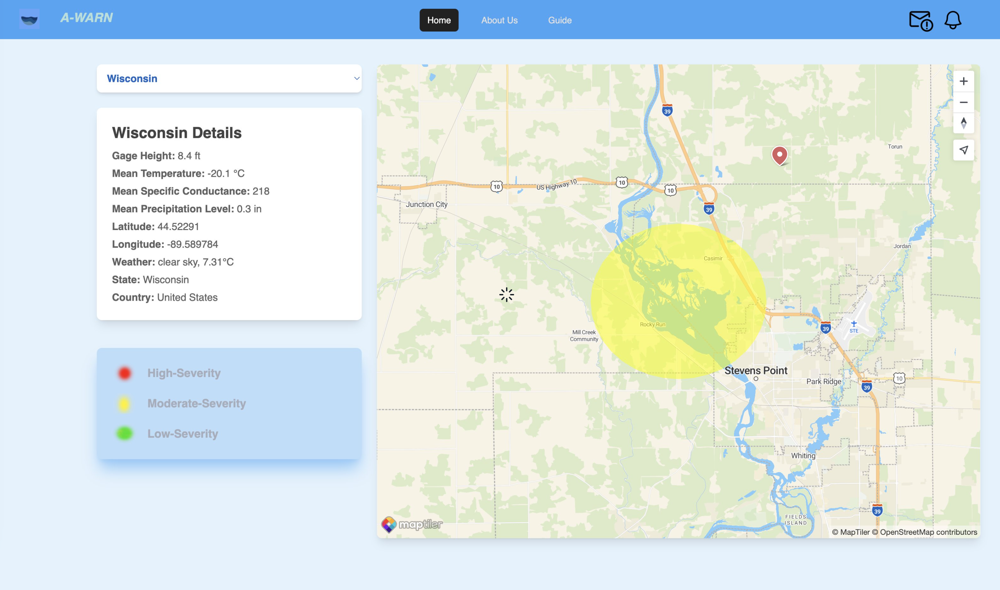
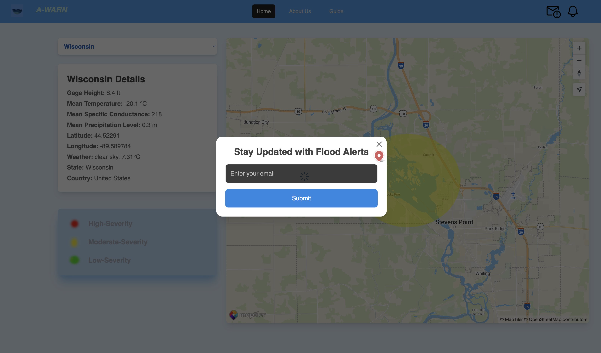

# Forewarning System: Natural Calamities

# Purpose

This problem statement highlights the ‘complexities of utilizing historical data on various triggering parameters and signals associated with natural calamities to forecast future events’. The overarching goal is ‘to enhance disaster preparedness and response efforts by leveraging historical data effectively’.
The purpose is to develop robust methodologies for utilizing historical data to enhance disaster preparedness and response efforts globally. This requires collaboration across disciplines and sectors to ensure that historical data is effectively leveraged to mitigate the impact of natural disasters.

# Product Scope

This research focuses on exploring the potential of combining historical data with machine learning (ML) techniques to improve the accuracy and effectiveness of natural disaster prediction and early warning systems.
Scope definition:
* Types of disasters
* Geographical scope
* Data utilization
* ML algorithms
* Forewarning system development

# AWARN : Overview

### DEMO

# Documentation

To view more about this project, visit the directory '/docs'.

## Exclusions:
This research will not delve into the social, economic, and political aspects of disaster management, focusing primarily on the technical aspects of prediction and early warning systems.
Optimization of specific ML algorithms and deep learning architectures may fall outside the scope based on resource constraints and project timelines.

